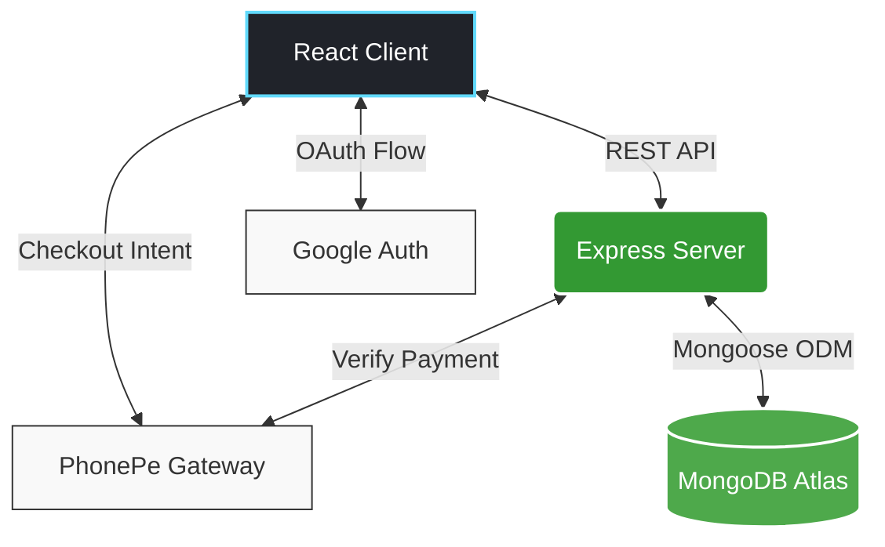

<p align="center">
  
</p>

<div align="center">
  <a href="https://reactjs.org/"></a>
  <a href="https://vitejs.dev/"></a>
  <a href="https://nodejs.org/"></a>
  <a href="https://expressjs.com/"></a>
  <a href="https://www.mongodb.com/"></a>
  <a href="https://www.phonepe.com/"></a>
</div>

<br/>

<div align="center">
  
</div>

<p align="center">
  <strong>A premium, lightning-fast restaurant management system built to elevate customer experiences and streamline operations.</strong>
</p>

<p align="center">
  <a href="#-highlights--capabilities">✨ Features</a> •
  <a href="#-system-architecture">🏗 Architecture</a> •
  <a href="#-quick-start-guide">🚀 Quick Start</a> •
  <a href="#-sneak-peek-screenshots">📸 Screenshots</a>
</p>

<hr/>

## 🎯 Highlights & Capabilities

<table align="center">
  <tr>
    <td align="center" width="50%">
      
      <h3>Beautiful Interactive Menu</h3>
      <p>Browse dishes with high-quality descriptions, categories, and dynamic pricing.</p>
    </td>
    <td align="center" width="50%">
      
      <h3>One-Click Google Auth</h3>
      <p>Zero-friction onboarding. Customers log in securely using their Google accounts.</p>
    </td>
  </tr>
  <tr>
    <td align="center" width="50%">
      
      <h3>PhonePe Integration</h3>
      <p>Secure, fast, and reliable digital transactions right at checkout.</p>
    </td>
    <td align="center" width="50%">
      
      <h3>Admin Command Center</h3>
      <p>Full control over inventory, orders, and stunning business analytics charts.</p>
    </td>
  </tr>
</table>

---

## 📸 Sneak Peek (Screenshots)

> *Placeholders for your amazing app screenshots!*

| Storefront & Cart 🛍️ | Admin Analytics 📈 |
| :---: | :---: |
|  |  |

---

## 🛠 Tech Stack Deep Dive

<details>
<summary><b style="font-size:16px;">🔍 Expand to view the complete MERN + Maps + Payments Stack</b></summary>
<br>

| Layer | Technologies | Purpose |
| :--- | :--- | :--- |
| **Frontend** | React 19, Vite | Blazing fast client-side rendering & UI |
| **Icons & Charts** | `lucide-react`, `recharts` | Beautiful SVG icons and dynamic data visualization |
| **Maps** | `@vis.gl/react-google-maps` | Interactive location maps for the restaurant |
| **Backend API**| Node.js, Express.js | Robust RESTful API architecture |
| **Database** | MongoDB Atlas, Mongoose | Scalable NoSQL cloud database |
| **Auth** | `@react-oauth/google` | OAuth 2.0 Identity verification |
| **Payments** | `@phonepe-pg/pg-sdk-node` | Server-side payment intent & verification |

</details>

---

## 🏗 System Architecture

The architecture ensures a seamless flow of data between the client, authentication providers, backend logic, and payment gateways.



---

## 🚀 Quick Start Guide

Ready to run this locally? Follow these steps:

### 1️⃣ Clone & Install
```bash
# Clone the repo
git clone <repository-url>
cd restaurant-website

# Install Frontend dependencies
npm install

# Install Backend dependencies
cd server
npm install
```

### 2️⃣ Environment Variables
Create a `.env` file in the root for Vite, and one in `server/` for Express.

<details>
<summary><b>View `.env` configurations</b></summary>

**`server/.env`**
```ini
PORT=3001
MONGODB_URI=your_mongodb_connection_string
```

**`/.env`** (Project Root)
```ini
VITE_GOOGLE_CLIENT_ID=your_google_oauth_client_id
VITE_GOOGLE_MAPS_API_KEY=your_google_maps_api_key
```
</details>

### 3️⃣ Fire It Up! 🔥
Run these commands in two separate terminal windows:

```bash
# Terminal 1: Backend
cd server
node index.js

# Terminal 2: Frontend
npm run dev
```
Open [http://localhost:5173](http://localhost:5173) and enjoy your new app!

---

<div align="center">
  
  <h3>Developed with ❤️ for the ultimate dining experience.</h3>
</div>
